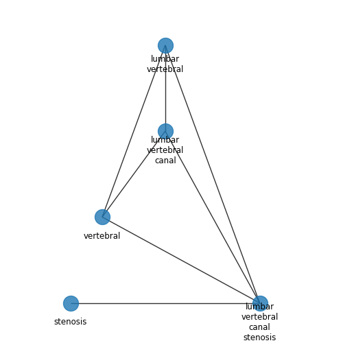
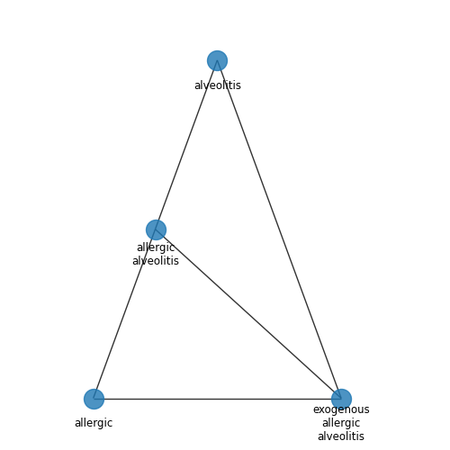

# BioNNE-L Shared Task at BioASQ 2025

The repository is devoted to the **BioNNE-L** (**Bio**medical **N**ested **N**amed **E**ntity **L**inking) Shared Task within the [BioASQ 2025 Workshop](https://www.bioasq.org/workshop2025) co-located with [CLEF 2025](https://clef2025.clef-initiative.eu).


## Shared Task Overview

The **BioNNE-L Shared Task** challenges participants to tackle medical concept normalization (MCN), also known as entity linking, for English and Russian languages.

**Goal:** map biomedical entity mentions to their corresponding concept names and unique identifiers (CUIs) within the Unified Medical Language System (UMLS).

**Data**: Entities from English and Russian scientific abstracts in the biomedical domain. The BioNNE-L task utilizes the MCN annotation of the NEREL-BIO dataset [1], which provides annotated mentions of disorders, anatomical structures, chemicals, diagnostic procedures, and biological functions.

**Evaluation Tracks:** Similar to the [BioNNE 2024 task](https://ceur-ws.org/Vol-3740/paper-03.pdf) [2], the evaluation is structured into **Three Subtasks** under **Two Evaluation Tracks**:

* Two **Monolingual Tracks** requiring separate models for English (**Subtask 1**) and Russian (**Subtask 2**);
    
* **Bilingual Track**: requiring a single model trained on multilingual dataset combined from English and Russian data (**Subtask 3**). Please note that predictions from any mono-lingual model are not allowed in this track.


**Shared Task-Specific Challenges:**

* **Nestedness:** Complexity of nested entity mentions. Below, you can find nested entities vizualized as graphs with entities as nodes. If an entity is nested ito another, the two nodes are connected with an edge:

<p align="center">


</p>

Here, our assumption is that two or more nested entities can serve as additional context mutually, and the **entity linking should be conducted jointly for all the single entities** as the predicted concepts should be consistent with each other.

* **Partial terminology**: a concept does not have concept name in low-resource language (Russian) and thus has to be linked to a vocabulary entry in rich-resource language (English).

## Data

### Data Overview

* [Tsv-formatted](data/tsv) and [Parquet-formatted](data/parquet) entities (We provide two formats for your convenience. The content for both formats is identical)

* [Parquet-formatted vocabular](data/vocabular)

* [Raw texts](data/texts)

The provided BioNNE-L Shared Task data (annotated entities and normalization vobcaulary) is available through [HuggingFace](https://huggingface.co/datasets/andorei/BioNNE-L):

```
# Loading multilingual data (Track 2)
bilingual_dataset = load_dataset("andorei/BioNNE-L", "Bilingual", split="train")

# Loading monolingual data (Track 1: Russian/English)
ru_dataset = load_dataset("andorei/BioNNE-L", "Russian", split="train")
en_dataset = load_dataset("andorei/BioNNE-L", "English", split="train")

# Loading normalization vocabulary
vocab = load_dataset("andorei/BioNNE-L", "Vocabulary", split="train")
```

### Annotated Data Format

Each line describes a single biomedical entity of possible entity types: (i) Disease (**DISO**), (ii) Chemical (**CHEM**), (iii) Anatomy (**ANATOMY**).


* `document_id` is a unique textual document identifier the given entity is derived from. Each document contains multiple entities described with their `spans` in the document;

* `text` is a textual mention string of the given entity;

* `entity_type` can take one of three values: DISO, CHEM, ANATOMY. These are high-level semantic types supported by the underlying UMLS knowledge base;

* `spans` provides a list of comma-separated entity positions within the given textual document with id `doc_id`. Each span entry provides starting and ending positions, e.g., `22-28`. An entity provided with multiple positions (e.g., `472-476,492-500` for lung injuries) corresponds to an interrupted entity with non-entity words inserted between entity words;

* `UMLS_CUI` is the Concept Unique Identifier (**CUI**) in the UMLS metathesaurus (UMLS serves the normalization vocabulary). This field provides ground truth CUI for the given entity. We note that the predicted CUI in your submission file must be in **prediction** column.

Here are some entity examples:

```
document_id      text    	                 entity_type     spans    	             UMLS_CUI
------------------------------------------------------------------------------------------------------
24052682_ru 	 заболеваниями печени 	         DISO 	         1545-1558,1568-1574 	     C0023895   
25842921_en 	 chronic heart failure 	         DISO 	         198-219 	             C0264716
26036067_en 	 right posterior carpal region   ANATOMY  	 1735-1764 	             C4240186   
26027241_en 	 lymphocyte antigen 	         CHEM 	         580-598 	             C0023158 
```

### Normalization Vocabulary

In our work, we collect the bilingual concept vocabulary derived from English and Russian UMLS parts. Due to incompleteness of Russian vocabulary (**Partial terminology** challenge), part of Russian entities have to be mapped to an English vocabular entry. Vocabulary file is a tsv file with the following fields:

`CUI` - UMLS CUI;

`semantic_type` - Concept's semantic type (DISO/CHEM/ANATOMY);

`concept_name` is a textual concept name derived from UMLS. Each concept can have multiple vocabular entries with different names but sharing the same CUI.


Here are some vocabular entity examples:


```
CUI	    semantic_type   concept_name
-------------------------------------------------
C0018995	DISO	    Hematochromatosis
C0018995	DISO	    Bronze diabetes (disorder)
C0018995	DISO	    Cirrhosis, Pigmentary
C0018995	DISO	    Гемохроматоз
C0018995	DISO	    Цирроз пигментный
C0018995	DISO	    Сидерофилия
C0018995	DISO	    Диабет бронзовый
C5399736	CHEM	    Serotonin-4 Receptor Agonist [EPC]
C5399736	CHEM	    Serotonin 5-Hydroxytryptamine-4 Receptor Agonist
C5399736	CHEM	    Serotonin-4 Receptor Agonist
```

## Baseline Solution

TBA

## Evaluation

### Evaluation Restrictions

1. For Track 2 (Multilingual), predictions from any mono-lingual model are not allowed.
2. For Track 1 (Russian/English), participants are required to treat each language as a separate task. **Distinct models and prediction files are necessary for English and Russian.**
3. Prediction files between two tracks should not match.

### Submission Format

A prediction file is expected to be as TSV with 4 columns: (1) `document_id`, (2) `spans`, (3) `rank`, (4) `prediction`.

* `document_id` and `spans` values should match the ones given in the unlabeled data. The concatenation of these two fields serves as a **unique primary key** clearly defining an underlying entity. So, **make sure you do not modify the provided document identifiers and entity spans**.

* `rank` is an integer rank of a retrieved vocabular concept. **Note: the ranks should be in range from 1 to 5.**

* `prediction` column must contain a valid UMLS CUI matching a CUI from the nromalization vocabulary. 

* `UMLS_CUI` is the Concept Unique Identifier (**CUI**) in the UMLS metathesaurus (UMLS serves the normalization vocabulary). This field provides ground truth CUI for the given entity. We note that the predicted CUI in your submission file must be in **prediction** column.


### Evaluation metrics

We address the BioNNE-L as a retrieval task: given a mention, a model must retrieve the top-k concepts from the given UMLS vocabulary. We employ two evaluation metrics:

1. Accuracy@k: $\mathrm{Accuracy@k}=1$ if the correct UMLS CUI is retrieved at rank $\le k$, otherwise $\mathrm{Accuracy@k}=0$.

2. MRR: $MRR = \frac{1}{|E|} \sum_{e \in E} \frac{1}{rank_{e}},$

where $E$ is the set of entities, $|E|$ is the number of entities, $rank_{e}$ is the rank of the first correctly retrieved concept among top-k retrieved concepts.

## Important Dates:


| Phase                                      | Date             |
|--------------------------------------------|------------------|
| Training Data Release                       | 5 Feb 2025       |
| Dev data release, Development phase start   | 19 Feb 2025      |
| Test data release, Evaluation phase start | 25 April 2025    |
| Test set predictions due                    | 6 May 2025       |
| Submission of participant papers            | 31 May 2025      |
| Acceptance notification for participant papers | 24 June 2025     |
| Camera-ready working notes papers         | 8 July 2025      |
| BioASQ Workshop at [CLEF 2025](https://clef2025.clef-initiative.eu)              | September 9-12, 2025 |


## References

[1] Loukachevitch, Natalia, Andrey Sakhovskiy, and Elena Tutubalina. [Biomedical Concept Normalization over Nested Entities with Partial UMLS Terminology in Russian](https://aclanthology.org/2024.lrec-main.213). Proceedings of the 2024 Joint International Conference on Computational Linguistics, Language Resources and Evaluation (LREC-COLING 2024). 2024.

[2] Davydova, Vera, Natalia Loukachevitch, and Elena Tutubalina. [Overview of BioNNE task on biomedical nested named entity recognition at BioASQ 2024](https://ceur-ws.org/Vol-3740/paper-03.pdf). CLEF Working Notes (2024).

