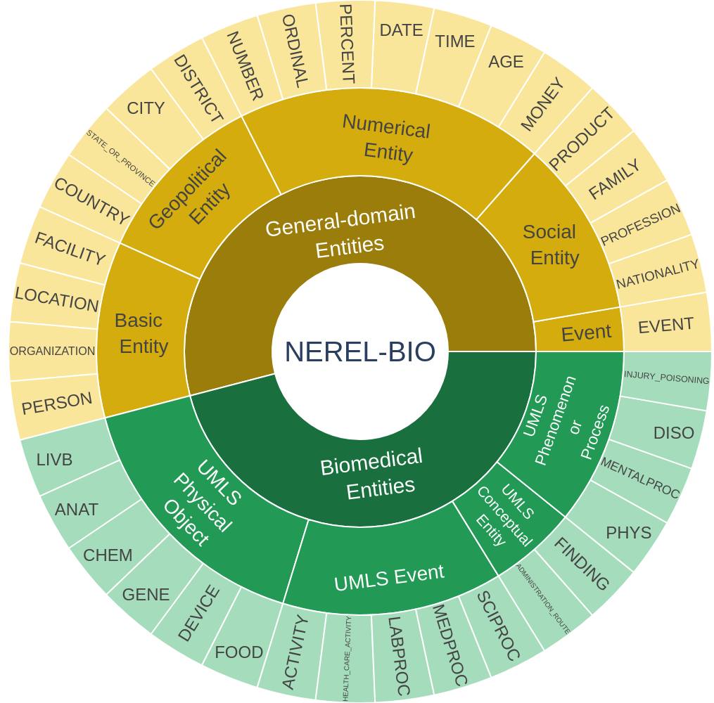

# NEREL-BIO: Biomedical Corpus for Nested Named Entity Recognition

This project presents NEREL-BIO -- an annotation scheme and corpus of PubMed abstracts in Russian and in English. NEREL-BIO extends the general domain dataset [NEREL](https://github.com/nerel-ds/NEREL). [NEREL-BIO annotation scheme](https://github.com/nerel-ds/NEREL-BIO/blob/master/nerel-bio-guidelines.pdf) covers both general and biomedical domains making it suitable for domain transfer experiments. 

<p align="center">

</p>
## News

`Ferbuary 2025` We are pleased to announce the BioNNE-L (Biomedical Nested Named Entity Linking) Shared Task which will take place during the BioASQ 2025 Workshop co-located with CLEF 2025 hosted at Madrid, Spain, 9-12 September 2025. For more information, please visit [https://github.com/nerel-ds/NEREL-BIO/tree/master/bio-nne](https://github.com/nerel-ds/NEREL-BIO/tree/master/BioNNE-L_Shared_Task)

`September 2024` Our paper ["Overview of BioNNE Task on Biomedical Nested Named Entity Recognition at BioASQ 2024"](https://ceur-ws.org/Vol-3740/paper-03.pdf) has been published at CLEF 2024. 

`March 2024` Our paper about **nested entity linking** has been accepted to COLING 2024. For more information and new annotations, please visit https://github.com/nerel-ds/NEREL-BIO/tree/master/nested-mcn

`Ferbuary 2024` NEREL-BIO is being used as dataset for the BioNNE shared task on nested NER in English and Russian (BioASQ workshop, CLEF 2024). For more information, please visit https://github.com/nerel-ds/NEREL-BIO/tree/master/bio-nne

`November 2023` [](https://github.com/nicolay-r/arekit-ss#usage) our collection is now available in [arekit-ss](https://github.com/nicolay-r/arekit-ss)
> for a [quick sampling](https://github.com/nicolay-r/arekit-ss#usage) of contexts with most subject-object relation mentions with just single script into
> `JSONL/CSV/SqLite` including (optional) language transfering 🔥 [[Learn more ...]](https://github.com/nicolay-r/arekit-ss#usage)

`April 2023` NEREL-BIO has been published in [Bioinformatics](https://academic.oup.com/bioinformatics/article/39/4/btad161/7099619). 


### List of entity types

|No. | Entity type | No. | Entity type | No. | Entity type
|---|---|---|---|---|---
|1. | ACTIVITY | 14. | MEDPROC | 27. | MONEY
|2. | ADMINISTRATION_ROUTE | 15. | MENTALPROC | 28. | NATIONALITY
|3. | ANATOMY | 16. | PHYS | 29. | NUMBER
|4. | CHEM | 17. | SCIPROC | 30. | ORDINAL
|5. | DEVICE | 18. | AGE | 31. | ORGANIZATION
|6. | DISO | 19. | CITY | 32. | PERCENT
|7. | FINDING | 20. | COUNTRY | 33. | PERSON
|8. | FOOD | 21. | DATE | 34. | PRODUCT
|9. | GENE | 22. | DISTRICT | 35. | PROFESSION
|10. | INJURY_POISONING | 23. | EVENT | 36. | STATE_OR_PROVINCE
|11. | HEALTH_CARE_ACTIVITY | 24. | FAMILY | 37. | TIME
|12. | LABPROC | 25. | FACILITY |  | 
|13. | LIVB | 26. | LOCATION |  | 

### Baselines for nested entities
 - [Machine Reading Comprehension model](https://github.com/fulstock/mrc_nested_ner_ru)
 - [Second-best Sequence model](https://github.com/fulstock/second-best-learning-and-decoding-rubert)

## Concept Normalization over Nested Entities

We release entity normalization (entity linking) annotation over nested entities, [see](https://github.com/nerel-ds/NEREL-BIO/tree/master/nested-mcn/data).

### Citation
Loukachevitch N., Manandhar S., Baral E., Rozhkov I., Braslavski P., Ivanov V., Batura T., Tutubalina E. NEREL-BIO: a dataset of biomedical abstracts annotated with nested named entities. Bioinformatics. 2023. Volume 39, Issue 4, btad161. https://doi.org/10.1093/bioinformatics/btad161
```
@article{NERELBIO,
    author = {Loukachevitch, Natalia and Manandhar, Suresh and Baral, Elina and Rozhkov, Igor and Braslavski, Pavel and Ivanov, Vladimir and Batura, Tatiana and Tutubalina, Elena},
    title = "{NEREL-BIO: A Dataset of Biomedical Abstracts Annotated with Nested Named Entities}",
    journal = {Bioinformatics},
    year = {2023},
    month = {04},
    issn = {1367-4811},
    doi = {10.1093/bioinformatics/btad161},
    url = {https://doi.org/10.1093/bioinformatics/btad161},
    note = {btad161},
}
```

Our papers on entity linking annotations and BioNNE shared task:
```
@CONFERENCE{Loukachevitch20242383,
	author = {Loukachevitch, Natalia and Sakhovskiy, Andrey and Tutubalina, Elena},
	title = {Biomedical Concept Normalization over Nested Entities with Partial UMLS Terminology in Russian},
	year = {2024},
	journal = {2024 Joint International Conference on Computational Linguistics, Language Resources and Evaluation, LREC-COLING 2024 - Main Conference Proceedings},
	pages = {2383 – 2389},
}

@CONFERENCE{Davydova202428,
    author = {Davydova, Vera and Loukachevitch, Natalia and Tutubalina, Elena},
    title = {Overview of BioNNE Task on Biomedical Nested Named Entity Recognition at BioASQ 2024},
    year = {2024},
    journal = {CEUR Workshop Proceedings},
    volume = {3740},
    pages = {28 – 34}
}

@ARTICLE{Nentidis2024490,
    author = {Nentidis, Anastasios and Krithara, Anastasia and Paliouras, Georgios and Krallinger, Martin and Sanchez, Luis Gasco and Lima, Salvador and Farre, Eulalia and Loukachevitch, Natalia and Davydova, Vera and Tutubalina, Elena},
    title = {BioASQ at CLEF2024: The Twelfth Edition of the Large-Scale Biomedical Semantic Indexing and Question Answering Challenge},
    year = {2024},
    journal = {Lecture Notes in Computer Science (including subseries Lecture Notes in Artificial Intelligence and Lecture Notes in Bioinformatics)},
    volume = {14612 LNCS},
    pages = {490 – 497},
    doi = {10.1007/978-3-031-56069-9_67}
}
```
