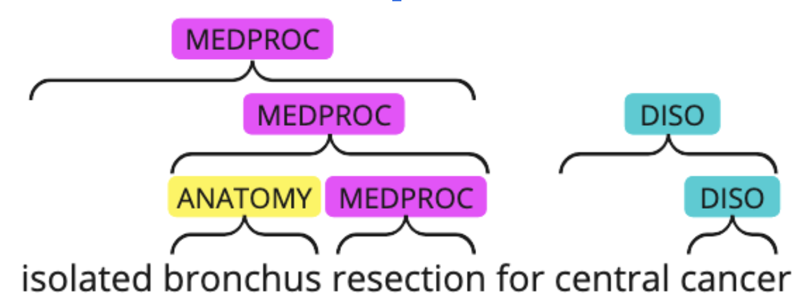

# [BioNNE task on Nested Named Entity Recognition](http://participants-area.bioasq.org/general_information/BioNNE/)

## Introduction

This is the repository for BioNNE (Biomedical Nested Named Entity Recognition) task. This task is a part of ([BioASQ](http://bioasq.org/)) Workshop that will be held at [CLEF 2024](https://clef2024.imag.fr/).

BioNNE involves NLP challenges on biomedical nested named entity recognition (NER) systems for English and Russian languages.

The evaluation framework is divided into three broad tracks:

*    Track 1 - Bilingual: Participants in this track are required to train a single multi-lingual NER model using training data for both Russian and English languages. The model should be used to generate prediction files for each language's dataset. 

*    Track 2 - English-oriented: Participants in this track are required to train a nested NER model for English scientific abstracts in the biomedical domain. Participants are allowed to train any model architecture on any publicly available data in order to achieve the best performance. 

*    Track 3 - Russian-oriented: Participants in this track are required to train a nested NER model for Russian scientific abstracts in the biomedical domain. Participants are allowed to train any model architecture on any publicly available data in order to achieve the best performance.

Nested Named Entity Annotation example

## Dataset

The train/dev splits are based on an improved subset of NEREL-BIO dataset. In particular, compared to the original dataset, we fixed some annotators' errors, merged PRODUCT and DEVICE type classes into DEVICE class and selected the eight most common medical entities from the dataset: FINDING, DISO, INJURY_POISONING, PHYS, DEVICE, LABPROC, ANATOMY, CHEM. The annotation format is BRAT. The resulting dataset consists of 661 annotated PubMed abstracts in Russian and 105 parallel abstracts in Russian and English.

In order to download our train/dev splits with annotations in English and Russian for BioNNE 2024, please register at the [BioASQ](http://participants-area.bioasq.org/#) website.

We strongly encourage participants to apply cross-language (Russian to English) and cross-domain (existing bio NER corpora to the BioNNE set) techniques in the BioNNE Task.
For example, you can use the following datasets:

- [NEREL](https://github.com/nerel-ds/NEREL) (Russian, general-domain, nested named entities, BRAT format)
- [RuCCoN](https://github.com/AIRI-Institute/RuCCoN) (Russian, electronic health records, flat named entities, BRAT format)
- [MedMentions](https://github.com/chanzuckerberg/MedMentions) (English, PubMed abstracts, PubTator format)
- BC2GM, BC5-chem, BC5-disease, EBM PICO, JNLPBA, NCBI-disease from the [BigBio library](https://github.com/bigscience-workshop/biomedical)  (English, PubMed abstracts, flat named entities)

## Baseline Solution
You can find the baseline solution in the [baseline_model](https://github.com/nerel-ds/NEREL-BIO/tree/master/bio-nne/baseline_model) directory.

## Submitting the results
You need to register on the official [BioNNE Codalab page](https://codalab.lisn.upsaclay.fr/competitions/16464) in order to submit your results and see the leaderboard. Please note that your submission should only include the JSON with your predictions archived in .zip format. 

The span-level macro-averaged F1 will be used as an evaluation metric. 

## Timeline
Phase |	Dates
--- | --
Registration opens |	13 Nov 2023
Training Data Release |	5 Feb 2024
Test data release, evaluation phase starts | 25 April 2024
Test set predictions due | 6 May 2024
Submission of participant papers  | 31 May 2024
Acceptance notification for participant papers | 24 June 2024
Camera-ready working notes papers | 8 July 2024
BioASQ Workshop at CLEF 2024, Grenoble, France | September 9-12, 2024

See also important dates on the [CLEF 2024](https://clef2024.imag.fr/index.php?page=Pages/schedule.html) website.

## Organizers
Vera Davydova, Sber AI, email: veranchos@gmail.com

Dr. Elena Tutubalina, Artificial Intelligence Research Institute (AIRI), email: tutubalinaev@gmail.com

Dr. Natalia Loukachevitch, Research Computing Center of Lomonosov Moscow State University (MSU), email: louk_nat@mail.ru
